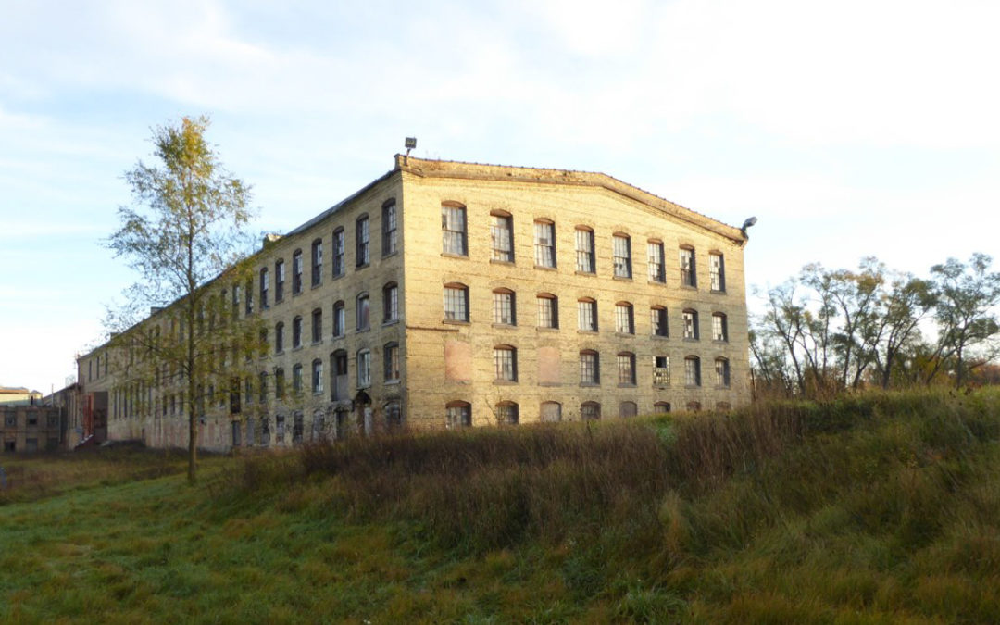
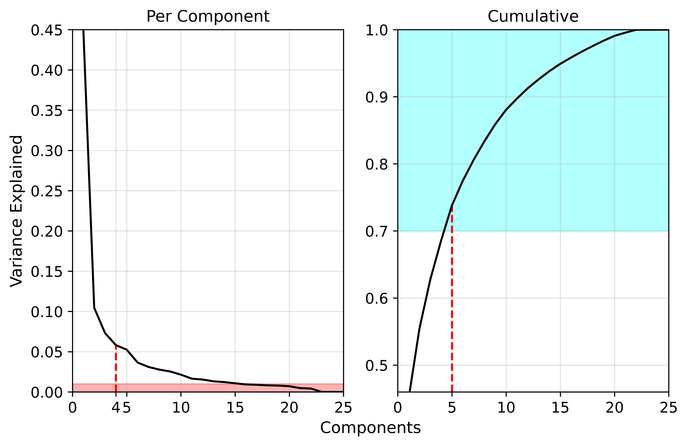

# Mapping the Rust Belt
#### By: Matt Ring

## Introduction

I couldn't tell you the first time I saw a shuttered factory. It might have been the vacant paper mill in Vicksburg, MI, one of many in the Kalamazoo area, shown above. Little did I know, these buildings marked a trend that spans broad swaths of the United States' manufacturing heartland. This "Rust Belt" is defined by deindustrialization, as are the lives of all who live there.

While a part of my life, my conception of the Rust Belt was always vague. Detroit, Chicago, and Pittsburgh were definitely in the Rust Belt, but what about Minneapolis, Des Moines, or Louisville? Questions about the boundaries of the Rust Belt came to my attention after reading [this](https://medium.com/migration-issues/where-is-the-rust-belt-d1dd280cf8a8) piece. While many of the variables made sense, the end result felt presupposed. Features were selected to fit the authors preconceived notion of the Rust Belt's boundaries.

Thus, I set out to compile a range of features and present them in an interactive display. It is my hope that this can serve as a guide for future work. Many visualizations pertaining to socioeconomic experiences portray only a static, singular perspective. When defining something so subjective, few approaches are as meaningful as interactivity. Likewise, exploring interactive visualizaitons can serve as a springboard into more in-depth analysis and discussions.

## Data

All data used comes from the Census, including the [5-year American Community Survey](https://www.census.gov/data/developers/data-sets/acs-5year.html), [New Residential Construction](https://www.census.gov/construction/nrc/index.html) survey, and [decennial Census](https://data.census.gov/cedsci/). Due to difficulties accessing historical information, data are only from 2000 to 2019. Most features include only data from 2010 to 2019, except for manufacturing employment (2000-2010), rural level (2010), and foreign born population (2000-2019). All data are numeric, exept "rural level", which is categorical and defines a range of urban to rural values from 1 to 6. Data for states from Louisiana in the Southwest to Maine in the Northeast are used as these contain the main manufacturing hubs of the United States.

Three main steps were taken to transform these data. First, data were normalized based on population. Second, change in each feature over time by county was calculated. For example, these data went from a value of manufacturing employment to change in manufacturing employment for every county. The data at this stage are shown in the interactive visualizations below.

<iframe src = "raw_dist.html" width = "945" height = "500"></iframe>

In the figure above, the blue line represents zero change. No axes are shown as these points have already been normalized and aggregated. What is of interest is the general distribtuion as opposed to any specific values. Points to the right show counties with increases in that feature, and those to the left represent decreases. Points are spaced vertically for ease of viewing; The y-value does not give any additional information.

<iframe src = "raw_corr.html" width = "945" height = "500"></iframe>

Much like the feature distributions, the above figure contains no speific values. Instead, note the blue and red dotted lines that represent positive and negative correlation, respectively. Highly correlated features, such as the percent of the population that identifies as white or black, will follow one of these lines. Having features like this can be an issue due to their redundany, making certain general features appear more important than they actually are.

## Enter: Prinipal Component Analysis

Our third data transformation remedies the aforementioned correlated features. Principal Component Analysis (PCA) creates a new set of features, called principal components, from raw features to represent the underlying structure of these data. For example, rent, home value, and housing construction, may all be compressed to the same general "housing" feature. In this way, PCA retains the information that helps differentiate our counties in fewer features.

To find the optimal number of principal components, first, we only take features which explain greater than 1% of the variance in the data. Second, we take enough features to explain more than 70% of the total variance in our data. Third, we use the scree plot shown below to determine the point of diminishing returns for adding components. Known as the elbow, we should take all features before explained variance diminishes. Finally, we want to ensure manufacturing employment is an included component.

In the scree plot above, there is an elbow around four components and poor variance explanation beyond 15 components. Likewise, based on the cumulative variance plot, at least five components are needed to adequately explain the variance in the data. Using this information, six components were selected. The third component is almost entirely explained by manufacturing employment, which meets our final criteria for PCA. Each principal components is defined as follows:

1. Urban - Almost exclusively correlated with "urban-ness"</li>
2. Income Growth - Mainly correlated with income increase</li>
3. Manufacturing Decline - Almost exclusively correlated with manufacturing employment decline</li>
4. Economic Recovery - Correlated with delines in rent, poverty, public assistance, and inequality</li>
5. Residential Construction - Correlated mainly with single-family home construction</li>
6. Inequality - Correlated with inequality increases and a decrease in public assistance</li>
7. Race - Correlated positively with increasing white populations</li>

The following two visualizations recreate the previous distribution and correlation figures for the principal components data. Once again, the vertical blue line shows the zero point in the distribution, and the diagonal blue and red dotted lines show positive and negative correlation, respectively. Note the more normalized distributions and lack of correlation. PCA has helped us create useful and distinct features which we can now use for the final visualizaition.

<iframe src = "pca_dist.html" width = "945" height = "500"></iframe>

<iframe src = "pca_corr.html" width = "945" height = "500"></iframe>

## Results

Using these seven new features, an interactive visualization of socioeconomic factors has been created below. Using the sliders, one can define a range with which to subset the data. Note that the values of these features are meaningless on their own. Instead, they should be interpretted in relation to one another. A value of 0.5 for manufacturing decline, for instance, means that county lost a greater percent of its manufacturing workforce than a countywith a value of zero. The initial values have been set to generally define the Rust Belt but can be adapted as one sees fit.

<iframe src = "final_viz.html" width = "945" height = "700"></iframe>

## Conclusions & Discussion
  
Based on the initial values, counties which saw greater manufacturing decline from 2000 to 2010 somewhat defines the Rust Belt. There is a clear set of counties, centered on Michigan, which surround the lower Great Lakes region. Interestingly, a belt of Southern counties also appears, likely representing the textile industry.

Hopefully you've enjoyed exploring these data as much as I have. Interactive visualizations allow one to draw personally meaningful conclusions and ignite discussion. Use this to start a lively discussion with your friends and family. Perhaps you could try to convince a Michigander, like myself, that they have more in common with Ohioans than they care to admit.

Lastly, no visualization is truly finished, nor any analysis perfect. Given the time, I'd like most to change the "rural level" feature and "Urban" principal component to be based on population density. Instead, it is currently based on Census-defined categories.
